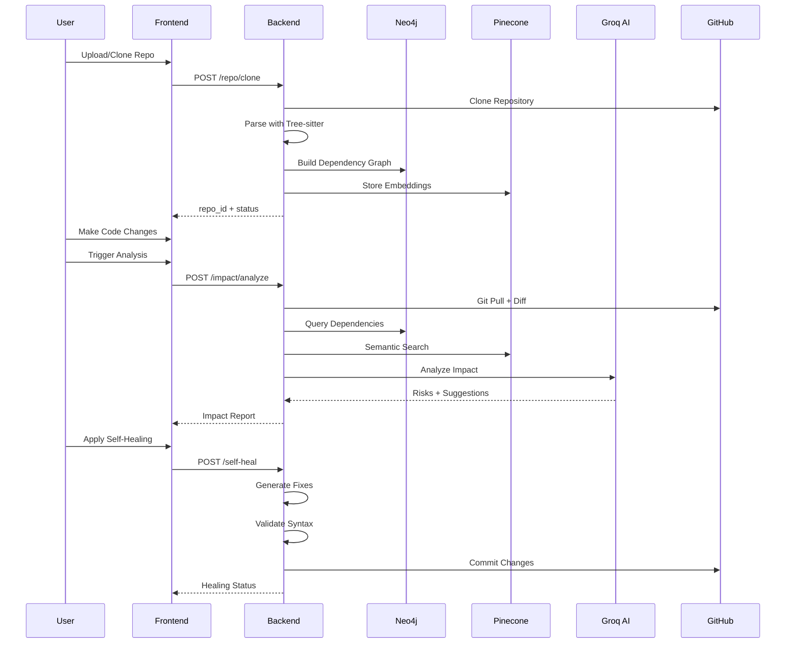

# 🛡️ RepoGuardian AI

<div align="center">


**An AI-powered repository intelligence system that analyzes codebase impact, detects downstream risks, and suggests self-healing fixes.**

[](https://fastapi.tiangolo.com/)
[](https://reactjs.org/)
[](https://neo4j.com/)
[](https://www.pinecone.io/)
[](https://www.typescriptlang.org/)

[Live Demo](#demo) • [Documentation](backend/API_DOCUMENTATION.md) • [Architecture](#architecture) • [Installation](#installation)

</div>

---

## 📋 Table of Contents

- [Problem Statement](#-problem-statement)
- [Solution](#-solution)
- [Features](#-features)
- [Architecture](#-architecture)
- [Tech Stack](#-tech-stack)
- [Installation](#-installation)
- [Demo Example](#-demo-example)
- [API Documentation](#-api-documentation)
- [Project Structure](#-project-structure)
- [Contributing](#-contributing)
- [Team](#-team)
- [License](#-license)

---

## 🎯 Problem Statement

Modern software development faces critical challenges:

### 1. **Repository Complexity**
- Developers struggle to understand large, interconnected codebases
- Difficult to trace how changes in one module affect others
- Hidden dependencies create unexpected breakages

### 2. **Change Impact Blindness**
- Small code changes can break downstream modules
- No visibility into ripple effects before deployment
- Manual code review misses architectural impacts

### 3. **Dependency Tracking Nightmare**
- Traditional tools only show surface-level dependencies
- Deep architectural relationships remain invisible
- Cross-file function calls are hard to trace

### 4. **Slow Feedback Loops**
- Bugs discovered only after deployment
- Manual debugging is time-consuming
- No proactive risk assessment

---

## 💡 Solution

**RepoGuardian AI** is an autonomous repository intelligence system that:

### 🔍 **Understands Your Codebase**
- **AST Parsing**: Deep code structure analysis using Tree-sitter
- **Multi-language Support**: Python, JavaScript, TypeScript, Java, C/C++
- **Semantic Understanding**: AI-powered code comprehension

### 🕸️ **Maps Dependencies**
- **Graph Database**: Neo4j stores complete dependency relationships
- **Function-level Tracking**: Traces every function call across files
- **Import Analysis**: Understands module dependencies

### 📊 **Analyzes Impact**
- **Risk Scoring**: Calculates impact of every code change
- **Downstream Detection**: Identifies all affected modules
- **Depth Analysis**: Measures dependency chain complexity

### 🤖 **AI-Powered Reasoning**
- **Groq Llama 3.3**: Lightning-fast AI analysis (70B parameters)
- **Context-Aware**: Uses RAG (Retrieval-Augmented Generation)
- **Explainable**: Provides clear reasoning for every suggestion

### 🔧 **Self-Healing**
- **Automatic Fixes**: AI generates safe code corrections
- **Validation Pipeline**: Syntax + static analysis checks
- **Rollback Safety**: Automatic backup and restore on failure

---

## ✨ Features

### 🎯 **1. Multi-Language AST Parsing**
- Parse code structure from 6+ programming languages
- Extract functions, classes, imports, and function calls
- Build comprehensive code knowledge base

### 🕸️ **2. Dependency Graph Generation**
- Neo4j graph database for relationship mapping
- Nodes: Files, Functions, Classes
- Edges: DEFINED_IN, CALLS, IMPORTS
- Query complex dependency chains in milliseconds

### 📈 **3. Impact Analysis Engine**
```
Risk Score = (Affected Nodes × Depth × Criticality)

Risk Levels:
• LOW: < 5 (Safe to merge)
• MEDIUM: 5-15 (Review recommended)
• HIGH: > 15 (Requires thorough review)
```

### 🧠 **4. AI-Powered Reasoning**
- **Model**: Groq Llama 3.3 70B (ultra-fast inference)
- **Embeddings**: Google Gemini (3072 dimensions)
- **Vector DB**: Pinecone for semantic search
- **Output**: Structured JSON with explanations, risks, and fixes

### 🔧 **5. Self-Healing Patch Suggestions**
- Detect breaking changes via git diff
- Generate AI-powered fixes
- Validate syntax and security
- Auto-commit or rollback based on validation

### 🎨 **6. Interactive Repository Visualization**
- Modern React UI with Tailwind CSS
- Real-time impact analysis dashboard
- Semantic code search interface
- Self-healing workflow management

---

## 🏗️ Architecture

### System Flow

```mermaid
graph TB
    A[GitHub Repository] -->|Clone/Upload| B[RepoGuardian Backend]
    B -->|Parse Code| C[Tree-sitter AST Parser]
    C -->|Extract Structure| D[Code Entities]
    D -->|Build Graph| E[Neo4j Graph DB]
    D -->|Generate Embeddings| F[Pinecone Vector DB]
    
    G[Code Change] -->|Git Diff| H[Change Detection]
    H -->|Query Graph| E
    H -->|Semantic Search| F
    E -->|Dependency Chain| I[Impact Analysis]
    F -->|Context| I
    
    I -->|Risk Score + Context| J[Groq Llama 3.3 AI]
    J -->|Analysis + Fixes| K[Self-Healing Engine]
    K -->|Validate| L{Syntax + Security Check}
    L -->|Pass| M[Apply Fix + Commit]
    L -->|Fail| N[Rollback + Alert]
    
    M -->|Generate| O[Pull Request]
    O -->|Create| P[GitHub PR]
    
    Q[React Frontend] -->|API Calls| B
    B -->|Real-time Updates| Q
    
    style B fill:#dc2626
    style E fill:#008CC1
    style F fill:#000000
    style J fill:#7C3AED
    style Q fill:#61DAFB
```



### Data Flow



### Component Architecture

```mermaid
graph LR
    subgraph Frontend
        A[React App] --> B[Dashboard]
        A --> C[Impact Analysis]
        A --> D[AI Analysis]
        A --> E[Self-Healing]
        A --> F[Code Search]
    end
    
    subgraph Backend
        G[FastAPI] --> H[Repository Service]
        G --> I[Parser Service]
        G --> J[Graph Service]
        G --> K[Impact Service]
        G --> L[AI Service]
        G --> M[Self-Healing Service]
        G --> N[PR Service]
    end
    
    subgraph Databases
        O[Neo4j Graph]
        P[Pinecone Vector]
    end
    
    subgraph AI
        Q[Groq Llama 3.3]
        R[Google Gemini]
    end
    
    A -->|REST API| G
    J --> O
    K --> O
    I --> P
    L --> Q
    I --> R
    
    style A fill:#61DAFB
    style G fill:#dc2626
    style O fill:#008CC1
    style P fill:#000000
    style Q fill:#7C3AED
```



---

## 🛠️ Tech Stack

### Frontend
- **Framework**: React 19 with TypeScript
- **Styling**: Tailwind CSS 4.0
- **State Management**: Zustand
- **Routing**: React Router v7
- **HTTP Client**: Axios
- **Animations**: Framer Motion
- **Build Tool**: Vite

### Backend
- **Framework**: FastAPI (Python)
- **Server**: Uvicorn (ASGI)
- **Code Parsing**: Tree-sitter (6 languages)
- **Graph Database**: Neo4j (Dependency mapping)
- **Vector Database**: Pinecone (Semantic search)
- **AI Models**:
  - **Groq Llama 3.3 70B**: Code analysis & reasoning
  - **Google Gemini**: Embeddings (3072 dimensions)
- **Git Operations**: GitPython
- **Validation**: Pydantic

### Infrastructure
- **Version Control**: Git + GitHub API
- **Environment**: Python 3.12+, Node.js 18+
- **Deployment**: Docker-ready (FastAPI + React)

---

## 📦 Installation

### Prerequisites
- Python 3.12+
- Node.js 18+
- Git
- Neo4j Account (free tier available)
- Pinecone Account (free tier available)
- Groq API Key (free tier available)
- Google Gemini API Key (free tier available)

### 1. Clone Repository
```bash
git clone https://github.com/yourusername/RepoGuardian_ai.git
cd RepoGuardian_ai
```

### 2. Backend Setup

#### Install Dependencies
```bash
cd backend
pip install -r requirements.txt
```

#### Configure Environment
Create `.env` file in `backend/` directory:
```env
# Neo4j (Graph Database)
NEO4J_URI=neo4j+ssc://xxxxx.databases.neo4j.io
NEO4J_USER=neo4j
NEO4J_PASSWORD=your_password

# Pinecone (Vector Database)
PINECONE_API_KEY=your_api_key
PINECONE_ENVIRONMENT=us-east-1
PINECONE_INDEX_NAME=repoguardian-gemini

# AI Models
GEMINI_API_KEY=your_gemini_key  # For embeddings
GROQ_API_KEY=your_groq_key      # For AI analysis
```

#### Start Backend Server
```bash
uvicorn app.main:app --reload --host 0.0.0.0 --port 8000
```

Backend will be available at: `http://localhost:8000`

API Documentation: `http://localhost:8000/docs`

### 3. Frontend Setup

#### Install Dependencies
```bash
cd frontend
npm install
```

#### Configure Environment
Create `.env` file in `frontend/` directory:
```env
VITE_API_URL_DEV=http://127.0.0.1:8000
VITE_API_URL_PROD=https://your-production-url.com
VITE_MODE=development
```

#### Start Development Server
```bash
npm run dev
```

Frontend will be available at: `http://localhost:5173`

### 4. Verify Installation

#### Test Backend
```bash
cd backend
python quick_test.py
```

#### Test All Endpoints
```bash
cd backend
python test_all_endpoints.py
```

---

## 🎬 Demo Example

### Scenario: Breaking Change Detection

#### Initial Code
```python
# auth.py
def validate_user(token):
    """Validate user authentication token"""
    return verify_token(token)
```

#### Developer Makes Change
```python
# auth.py
def validate_user(token, device_id):
    """Validate user with device tracking"""
    return verify_token(token) and verify_device(device_id)
```

### RepoGuardian AI Analysis

#### 1. **Change Detection**
```bash
POST /git/diff/{repo_id}
```
**Output:**
```json
{
  "changed_functions": ["validate_user"],
  "raw_diff": "- def validate_user(token):\n+ def validate_user(token, device_id):"
}
```

#### 2. **Impact Analysis**
```bash
POST /impact/analyze
```
**Output:**
```json
{
  "impact": [{
    "function": "validate_user",
    "affected_files": [
      "auth.py",
      "login.py",
      "payment.py",
      "api/endpoints.py"
    ],
    "risk_score": 12.5,
    "risk_level": "MEDIUM",
    "depth": 3,
    "semantic_context": [
      "Function 'validate_user' is called by 'process_payment' in payment.py",
      "Function 'validate_user' is used in authentication middleware"
    ],
    "static_issues": [
      "Function signature changed - breaking change detected"
    ]
  }]
}
```

#### 3. **AI Reasoning**
```bash
POST /ai/analyze
```
**Output:**
```json
{
  "analyses": [{
    "explanation": "The function signature of validate_user changed from 1 parameter to 2 parameters. This is a breaking change that will cause TypeError in all calling functions that don't pass device_id.",
    "risks": [
      "Breaking authentication in payment module",
      "API endpoints will fail with TypeError",
      "Login flow will crash without device_id parameter"
    ],
    "why_breaks": "All existing callers pass only 'token' parameter. The new 'device_id' parameter is required but not provided, causing immediate runtime errors.",
    "suggestions": [
      "Make device_id optional with default value: device_id=None",
      "Update all 4 calling functions to pass device_id",
      "Add backward compatibility wrapper function"
    ],
    "fixed_code": "def validate_user(token, device_id=None):\n    \"\"\"Validate user with optional device tracking\"\"\"\n    if device_id:\n        return verify_token(token) and verify_device(device_id)\n    return verify_token(token)"
  }]
}
```

#### 4. **Self-Healing**
```bash
POST /self-heal/
```
**Output:**
```json
{
  "summary": [{
    "entity": "validate_user",
    "file": "auth.py",
    "result": {
      "status": "applied",
      "message": "✅ Validation passed. AI fix applied and committed.",
      "rollback": false,
      "commit_hash": "a3f9c2d"
    }
  }]
}
```

#### 5. **Pull Request Generation**
```bash
POST /pr/generate
```
**Output:**
```json
{
  "pr_result": {
    "status": "success",
    "pr_number": 42,
    "pr_url": "https://github.com/owner/repo/pull/42",
    "branch": "repoguardian-ai-20260517-112000"
  },
  "summary": {
    "title": "[RepoGuardian AI] Automated Analysis - MEDIUM Risk",
    "risk_level": "MEDIUM",
    "risk_score": 12.5,
    "changed_entities": 1,
    "affected_files": ["auth.py", "login.py", "payment.py", "api/endpoints.py"],
    "recommendations": [
      "Review backward compatibility changes",
      "Test authentication flow with and without device_id",
      "Update API documentation"
    ]
  }
}
```

### Result
✅ **Breaking change detected and fixed automatically**
- 4 downstream files identified
- Risk score calculated: 12.5 (MEDIUM)
- AI-generated backward-compatible fix
- Syntax validated ✓
- Security checked ✓
- Committed to repository
- Pull request created with full analysis

---

## 📚 API Documentation

### Quick Reference

| Endpoint | Method | Description |
|----------|--------|-------------|
| `/repo/clone` | POST | Clone GitHub repository |
| `/repo/upload` | POST | Upload ZIP file |
| `/repo/sync/{id}` | POST | Sync with GitHub |
| `/scan/{id}` | GET | Scan repository files |
| `/parse/{id}` | GET | Parse code structure |
| `/graph/build/{id}` | POST | Build dependency graph |
| `/embeddings/store/{id}` | POST | Generate embeddings |
| `/embeddings/query` | POST | Semantic code search |
| `/git/diff/{id}` | POST | Get git diff |
| `/impact/analyze` | POST | Analyze change impact |
| `/ai/analyze` | POST | AI-powered analysis |
| `/self-heal/` | POST | Apply self-healing |
| `/pr/generate` | POST | Generate pull request |

### Complete Documentation
📖 **[Full API Documentation](backend/API_DOCUMENTATION.md)**

Includes:
- Detailed endpoint specifications
- Request/response examples
- Error handling
- Workflow examples
- Environment setup

### Interactive Documentation
- **Swagger UI**: `http://localhost:8000/docs`
- **ReDoc**: `http://localhost:8000/redoc`

---

## 📁 Project Structure

```
RepoGuardian_ai/
├── frontend/                      # React Frontend
│   ├── src/
│   │   ├── components/           # Reusable UI components
│   │   │   ├── ui/              # Button, Card, Modal, etc.
│   │   │   ├── Layout.tsx       # Main layout wrapper
│   │   │   └── ScrollProgress.tsx
│   │   ├── pages/               # Route pages
│   │   │   ├── Home.tsx         # Landing page
│   │   │   ├── Dashboard.tsx    # Main dashboard
│   │   │   ├── Repositories.tsx # Repo management
│   │   │   ├── AIAnalysis.tsx   # AI insights
│   │   │   ├── ImpactAnalysis.tsx
│   │   │   ├── SelfHealing.tsx
│   │   │   └── CodeSearch.tsx
│   │   ├── lib/
│   │   │   ├── api.client.ts    # Axios API client
│   │   │   └── utils.ts
│   │   ├── store/
│   │   │   └── useAppStore.ts   # Zustand state management
│   │   ├── types/
│   │   │   └── api.types.ts     # TypeScript types
│   │   ├── App.tsx              # Main app component
│   │   └── main.tsx             # Entry point
│   ├── public/                   # Static assets
│   ├── package.json
│   └── vite.config.ts
│
├── backend/                       # FastAPI Backend
│   ├── app/
│   │   ├── main.py               # FastAPI app + CORS
│   │   ├── routes/               # API endpoints
│   │   │   ├── repo.py          # Repository management
│   │   │   ├── scan.py          # File scanning
│   │   │   ├── parse.py         # Code parsing
│   │   │   ├── graph.py         # Graph operations
│   │   │   ├── embedding.py     # Vector embeddings
│   │   │   ├── git.py           # Git operations
│   │   │   ├── impact.py        # Impact analysis
│   │   │   ├── ai.py            # AI analysis
│   │   │   ├── self_heal.py     # Self-healing
│   │   │   └── pr.py            # PR generation
│   │   └── services/             # Business logic
│   │       ├── repo_service.py
│   │       ├── file_scanner.py
│   │       ├── parser_service.py
│   │       ├── graph_service.py
│   │       ├── embedding_service.py
│   │       ├── git_service.py
│   │       ├── impact_service.py
│   │       ├── static_analysis_service.py
│   │       ├── ai_service.py
│   │       ├── self_healing_service.py
│   │       └── pr_service.py
│   ├── data/
│   │   └── repos/                # Cloned repositories
│   ├── requirements.txt
│   ├── .env                      # Environment variables
│   ├── API_DOCUMENTATION.md      # Complete API docs
│   ├── IMPLEMENTATION_SUMMARY.md # Technical summary
│   ├── quick_test.py             # Quick verification
│   └── test_all_endpoints.py     # Comprehensive tests
│
├── README.md                      # This file
├── .gitignore
└── LICENSE
```

---

## 🤝 Contributing

We welcome contributions! See [CONTRIBUTING.md](CONTRIBUTING.md) for detailed guidelines.

**Quick Start:**
1. Fork the repository
2. Create a feature branch
3. Make your changes with tests
4. Submit a pull request

---

## 👥 Team

**RepoGuardian AI** is built by passionate developers who believe in autonomous code intelligence.

### Core Contributors

#### Backend Team
- **Jivites Damodar, Sukanthan** — Backend Architecture, API Development, AI Integration, Database Design

#### Frontend Team
- **Rahul LS, Prajwal Priyadarshan** — Frontend Architecture, UI/UX Design, Component Development, State Management, Deployment


### Acknowledgments
- Tree-sitter team for multi-language parsing
- Neo4j for graph database technology
- Groq for lightning-fast AI inference
- Pinecone for vector search capabilities

---

## 📄 License

This project is licensed under the MIT License - see the [LICENSE](LICENSE) file for details.

---

## 🌟 Star History

If you find RepoGuardian AI useful, please consider giving it a star! ⭐

---

## 📞 Support

- **Documentation**: [API Docs](backend/API_DOCUMENTATION.md)
- **Issues**: [GitHub Issues](https://github.com/yourusername/RepoGuardian_ai/issues)
- **Discussions**: [GitHub Discussions](https://github.com/yourusername/RepoGuardian_ai/discussions)

---

## 🎯 Roadmap

**Current Status:** ✅ All core features complete and production-ready

**Future Enhancements:**
- Real-time WebSocket updates
- Support for more languages (Go, Rust, Ruby)
- Advanced visualization dashboard
- Multi-repository analysis
- CI/CD pipeline integration

---

<div align="center">

**Built with ❤️ by developers, for developers**

[⬆ Back to Top](#️-repoguardian-ai)

</div>